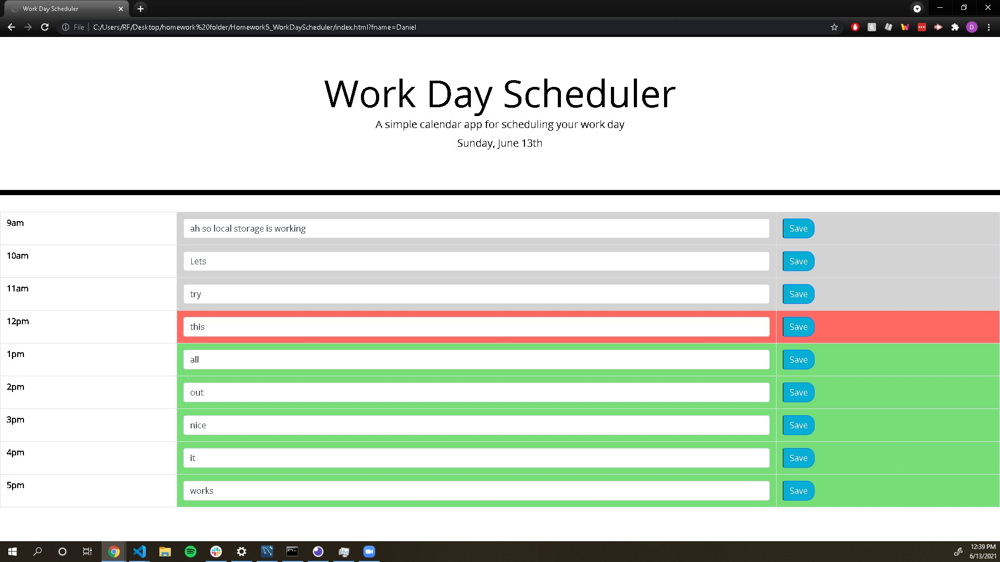

# Updated Portfolio (August 2021)

## App Description 
This app serves as a portfolio for myself to show off some of my work to future employers. It contains an about me section, resume section where you are able to open my resume in a new tab, a featured projects section to show off a few of my projects, and finally a contact me section which contains my contact information.

## Motivation Behind the project/why I built it
I built this new updated portfolio so I would have an extra thing to show future employers when I begin applying for internships very soon.

## Problems I came across during development
The biggest issue I came across was figuring a good color scheme, and although this isn't the best color scheme I could've chosen, it isn't the absolute worst and I plan on picking a different one once it comes time to update create a new portfolio.

## What I learned from this project
Although I didn't lean a whole lot from this project since I was really showing off what I already knew, the one thing I came across that became pretty helpful for the resume portion was making it so clicking on the button to pull my resume would open it in a new tab. Another thing I learned from this project was to emphasize keeping everything as organized as possible.

## App usage
This app is pretty simple to use, you simply open the link at the bottom of this ReadMe and you scroll through my information. All of the buttons work so you can use the navbar to quickly jump to a specific spot and you can press any of the buttons to complete their advertized action.

## Link to the App
https://dannyroubin.github.io/UpdatedPortfolio-June2021/
